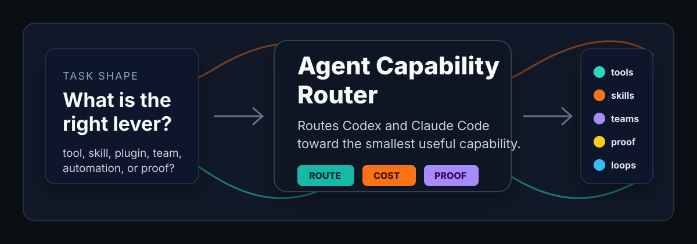

# Agent Capability Router



[](#install)
[](LICENSE)
[](references/runtime-adapters.md)

Stop making the agent guess which lever to pull.

`agent-capability-router` is a skill for **Codex** and **Claude Code** that routes a task into the right execution surface: local tools, plugins/connectors, skills, subagents, browser/docs lookup, completion goals, automations, hooks, memory capture, or verification.

It is not a permission slip. It is a routing layer: name the capability, name the cost, ask for approval when the move is broad or persistent, then prove the route worked.

## What It Helps With

Users usually ask in problem language:

- "Use your team to audit this."
- "Open localhost and check the UI."
- "Which plugin should handle this?"
- "Keep going until tests pass."
- "Remember this workflow."
- "Make sure this is safe before merge."

The router turns those signals into a concrete route, a cost/risk boundary, and a proof plan.

It stays quiet on small work. One file, one command, one obvious fix: just do the work. The router wakes up when the task shape suggests a better path.

## Runtime Compatibility

| Capability | Codex | Claude Code | Notes |
|---|---|---|---|
| Skill discovery | `~/.codex/skills/agent-capability-router` | `~/.claude/skills/agent-capability-router` | Same `SKILL.md` and references |
| Local tools | Shell, git, project CLIs | Shell, git, project CLIs | Prefer local proof for workspace facts |
| Plugins/connectors | Available MCP/app tools | Available MCP/app tools | Authenticated reads/writes are approval-gated |
| Subagents/workflows | Runtime-specific subagents/tools | Runtime-specific task/workflow tools | Use only when width or independent review pays off |
| Browser/docs/research | Runtime browser/docs/web tools | Runtime browser/docs/web tools | Use for rendered proof or current external facts |
| Automations/hooks/goals | Only when exposed by runtime | Only when exposed by runtime | Fallback is a checklist or proposed command |

## Requirements

- `bash` or compatible shell
- `python3` for validation and route preview scripts
- write access to the target skills directory if installing:
  - Codex: `~/.codex/skills`
  - Claude Code: `~/.claude/skills`
- explicit `--confirm` for any installer write

## Install

Clone the public repo:

```bash
git clone https://github.com/DeHor-Labs/agent-capability-router.git
cd agent-capability-router
```

Preview an install without writing:

```bash
./scripts/install-skill.sh --runtime both --dry-run
```

Install into both Codex and Claude Code:

```bash
./scripts/install-skill.sh --runtime both --mode copy --confirm
```

Install only for Codex:

```bash
./scripts/install-skill.sh --runtime codex --confirm
```

Install only for Claude Code:

```bash
./scripts/install-skill.sh --runtime claude --confirm
```

Replace an existing install safely:

```bash
./scripts/install-skill.sh --runtime both --mode copy --replace --confirm
```

Existing installs are backed up under `.agent-capability-router-backups` before replacement.

For local development, use a symlink:

```bash
./scripts/install-skill.sh --runtime both --mode symlink --dev-symlink --confirm
```

Use `--home /path/to/home` when testing installs in temporary directories or CI.

## Direct Clone Install

The repository root is the skill folder, so direct clone install also works:

```bash
git clone https://github.com/DeHor-Labs/agent-capability-router.git ~/.codex/skills/agent-capability-router
```

```bash
git clone https://github.com/DeHor-Labs/agent-capability-router.git ~/.claude/skills/agent-capability-router
```

The script-based install is preferred for updates because it copies only the skill payload and avoids repository-only test files.

## Validate

Run the local checks:

```bash
./scripts/validate-skill.py
./scripts/check-agent-neutrality.py
python3 -m unittest discover -s tests
```

For Codex skill packaging validation:

```bash
python3 /path/to/skill-creator/scripts/quick_validate.py .
```

Post-install spot check:

```bash
test -f ~/.codex/skills/agent-capability-router/SKILL.md
test -f ~/.claude/skills/agent-capability-router/SKILL.md
```

## Quick Examples

Route a broad audit into orchestration plus verification:

```bash
./scripts/route-task.py "Audit all API routes with your team and verify CI findings"
```

Expected route: `orchestration`. Approval required because it may spend subagent/workflow budget.

Route an authenticated service question into plugin selection:

```bash
./scripts/route-task.py "Which plugin should check the GitHub deployment status?"
```

Expected route: `tool-plugin-skill-routing`, with `risk_class` set to `authenticated_read`.

Route a future obligation into recurring work:

```bash
./scripts/route-task.py "Schedule a weekly check of release readiness"
```

Expected route: `recurring-work`. Approval required because it is persistent automation.

## The Core Contract

```text
Route: the smallest useful capability.
Cost: what it spends or risks.
Approval: what needs explicit consent.
Proof: what evidence closes the loop.
```

That contract matters because agent work fails in two boring ways:

- underpowered: one agent grinds through work that should have been split, verified, or routed through a real service tool
- overpowered: a simple local task becomes a noisy proposal, a needless browser session, or a pile of subagents

This skill tries to stay in the middle: enough leverage to matter, enough restraint to remain useful.

## Files In This Skill

```text
agent-capability-router/
  SKILL.md
  agents/openai.yaml
  references/
  scripts/
  tests/
```

`SKILL.md` stays small and routes to focused reference files only when needed.

## Safety Notes

- Start with `--dry-run` before installing.
- Installer writes require `--confirm`.
- Existing installs require `--replace` before backup and replacement.
- Symlink installs require `--dev-symlink` and are intended for local development.
- The router does not invent runtime tools. If a capability is unavailable, it should propose a safe fallback.
- Sensitive or authenticated contexts should bias toward local/read-only checks unless explicitly approved.

## Troubleshooting

`--runtime is required`:
Pass `--runtime codex`, `--runtime claude`, or `--runtime both`.

`Refusing to write without --confirm`:
Run with `--dry-run` first, then add `--confirm` when the target path is correct.

`Existing install found`:
Re-run with `--replace --confirm` to back up and replace the existing install.

`route-task.py` returns no route:
That is usually correct for simple tasks. The skill should stay quiet unless there are strong routing signals.

## License

MIT
